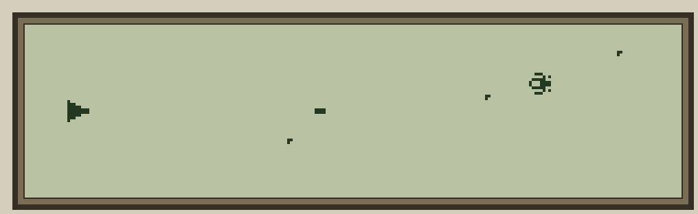

# DEFENDER v0.1 — Side-scrolling Defender for the Husky Hunter

A side-scrolling Defender-style game for the Husky Hunter. Shoot the enemies
before they reach your ship. You have 3 lives — lose them all and it's Game Over.



## Status

**v0.1 — Working on hardware (May 2026).** Based on DEFEND11 development iteration.

## Controls

| Key | Action |
|-----|--------|
| A / a | Ship up |
| Z / z | Ship down |
| SPACE | Fire laser |
| ESC | Exit to BASIC |

## Gameplay

- **Ship:** 8×8 pixel sprite at column 2 (left side), controlled with A/Z
- **Enemies:** Diagonal-drifting 8×8 sprites scrolling right-to-left; bounce off top/bottom
- **Wave 2:** A second enemy joins after 5 kills
- **Laser:** Single projectile, one active at a time; fire while previous shot is in flight is ignored
- **Lives:** 3 hearts displayed at top-left; enemy reaching the ship costs a life
- **Score:** Kill count; displayed on Game Over screen
- **Game Over:** Score displayed with PRESS ANY KEY prompt; press any key to restart

## Sound

| Event | Sound |
|-------|-------|
| Fire | Short ascending sweep |
| Explosion | Short descending blip |
| Death | Slow descending sweep |
| Game start | 4-note ascending chord |
| Game over | Long ascending sweep |

Sound is driven by BASIC `SOUND` called between MC frames — no game freeze artefacts.

## Technical Details

- **MC size:** 1435 bytes (Z80 machine code, generated by Python)
- **Splash MC size:** 1978 bytes (58 code + 1920 image data)
- **Method:** MC stored in DIM array via VARPTR, patched at runtime (118 patches)
- **Parameters:** 53 bytes at fixed address F605H (62981) — see [DEFEND_ASM/ASM_README.md](DEFEND_ASM/ASM_README.md)
- **LCD:** Direct HD61830 I/O with busy-checking (port 0x20/0x21)
- **Input:** BDOS fn 11 (non-blocking status) + fn 6 (read key)
- **Splash:** MC LCD blast — 1920-byte VRAM write via wait_busy/OUT loop, near-instant

## Files

| File | Description |
|------|-------------|
| `gen_defend_splash.py` | Python generator — outputs `Defend.BAS` here + `HBA/DEFEND.HBA` |
| `gen_defdat1.py` | Python generator — outputs `DefDat1.BAS` here + `HBA/DEFDAT1.HBA` |
| `Defend.BAS` | BASIC splash listing — MC image blast, auto-chains to DEFDAT1 |
| `DefDat1.BAS` | BASIC game listing — loads MC, runs game loop |
| `DEFEND_ASM/ASM_README.md` | Machine code documentation — param block, event dispatch, key techniques |
| `DEFEND_ASM/DEFEND.asm` | Z80 source (Intel-style, sjasmplus compatible) — byte-perfect match |
| `DEFEND_ASM/DEFEND.lst` | sjasmplus hex listing (addresses and bytes) |
| `DEFEND_ASM/DEFEND.dlst` | Decimal listing (for BASIC DATA transcription) |
| `DEFEND_ASM/POKE_LIST.txt` | DATA lines + patch table formatted to match DefDat1.BAS |
| `DEFEND_ASM/sprite_data.txt` | Ship/enemy/heart sprite reference with hex/binary/visual rendering |

Tokenised files for transfer via HCOM are in the main `HBA/` folder: `DEFEND.HBA`, `DEFDAT1.HBA`.

## Usage

On the Husky Hunter:

1. Transfer `HBA/DEFEND.HBA` and `HBA/DEFDAT1.HBA` to the Hunter via HCOM over RS-232
2. Enter `BAS`
3. `LOAD "DEFEND"`
4. `RUN` — splash displays instantly, then auto-chains to the game

To load the game directly (skipping the splash):

1. `LOAD "DEFDAT1"`
2. `RUN`

## Build

From the repository root:

```bash
python Progs/DefendERR/gen_defend_splash.py
python Progs/DefendERR/gen_defdat1.py
```

## Development Notes

Full development history (DEFEND1 through DEFEND11, 11 iterations) is documented
in [Dev/defender/DEFENDER_DEV.md](../../Dev/defender/DEFENDER_DEV.md).
