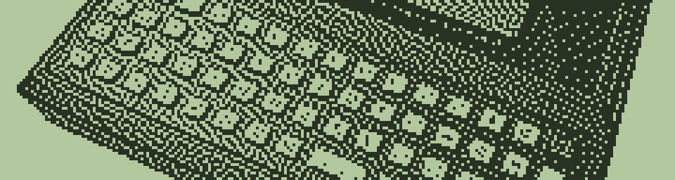

# png2hba — Image to Husky Hunter BASIC Converter

Converts PNG/JPEG images to Hunter BASIC programs (`.BAS`) that display on the Husky Hunter's 240×64 monochrome LCD.



## Status

Working — tested on real Husky Hunter hardware. The Python converter produces valid `.BAS` source files that tokenize and render correctly on the 240×64 LCD. Note: BAS `LOAD` may corrupt line 10 (see [Generated HBA](#generated-hba)).

**Development:** A direct I/O decoder (`IMGDIO.BAS`) was developed that writes image bytes directly to the HD61830 LCD controller via `OUT` statements, bypassing BASIC's PSET/LINE entirely. This achieves a 25x speedup over the baseline. A horizontal-run (hline) decoder (`IMGHLIN.BAS`) pre-computes runs at generation time for a 12x speedup. See [Development Notes](#development-notes--could-it-be-faster) for results.

## Usage

```
python png2hba.py <input_image> [options]
```

### Examples

```bash
# Default: Atkinson dither, crop to fill LCD
python png2hba.py Source_Images/product-137443.png -o HUSKY.BAS

# With LCD-style preview image
python png2hba.py photo.png -o PHOTO.BAS --preview preview.png

# Threshold dither for logos/line art
python png2hba.py logo.png -o LOGO.BAS -d threshold -t 200

# Adjust brightness and contrast
python png2hba.py dark_photo.jpg -o OUTPUT.BAS -b 1.5 -c 1.3

# Invert (swap black/white)
python png2hba.py photo.png -o INVERT.BAS -i
```

### Options

| Option | Default | Description |
|--------|---------|-------------|
| `-o` | `IMAGE.BAS` | Output .BAS filename |
| `-d` | `floyd-steinberg` | Dithering: `atkinson`, `floyd-steinberg`, `ordered`, `threshold` |
| `-t` | `128` | Threshold value 0–255 (threshold mode only) |
| `-f` | `fill` | Resize: `fill` (crop), `fit` (letterbox), `stretch` |
| `-b` | `1.0` | Brightness multiplier |
| `-c` | `1.0` | Contrast multiplier |
| `-i` | off | Invert image |
| `-m` | `auto` | HBA mode: `data`, `rle`, `draw`, `auto` |
| `-W` | `240` | Target width in pixels |
| `-H` | `64` | Target height in pixels |
| `--preview` | — | Save LCD-style preview PNG |

## Dithering Algorithms

| Algorithm | Best For | Notes |
|-----------|----------|-------|
| **atkinson** | Photos on LCD | High contrast, clean darks, Mac-style. Recommended. |
| **floyd-steinberg** | Smooth gradients | Classic error diffusion, smoothest tonal range |
| **ordered** | Retro aesthetic | Bayer 4×4 matrix pattern |
| **threshold** | Logos, line art | Pure black/white, smallest file, fastest render on Hunter |

## Output Modes

| Mode | Description |
|------|-------------|
| **data** | Bitmap packed as DATA bytes with bit-unpacking loop. ~8–9 KB for full LCD. Best for dense images. |
| **rle** | Run-length encoded (Y,X1,X2) triples using LINE/PSET. Compact for sparse images. |
| **draw** | Direct LINE/PSET statements. Only for very sparse images (<1000 runs). |
| **auto** | Picks rle or data based on estimated size. |

## Generated HBA

The output is a self-contained Hunter BASIC program. On the Husky Hunter:

1. Transfer to Hunter via serial or type directly
2. Enter `BAS`
3. `LOAD "HIMAGE"`
4. `RUN`

Note that some corruption was observed at line 10 (quirk?) when loading
into BAS — the file checks OK on disk but `LOAD` corrupts it. Retyping
the line fixed it. Alternatively it may be possible to send the file
via RS-232 while in BAS.
See [HUNTER_BASIC_GOTCHAS.md](../../HUNTER_BASIC_GOTCHAS.md) for details.

The program enters `SCREEN 1` (240×64 graphics mode), draws the image pixel-by-pixel, then waits for any keypress before returning to `SCREEN 0`.

### Data Mode Decoder

The bitmap is packed as bytes in DATA statements. The decoder uses successive subtraction to test bits (no bitwise AND needed — safe for Hunter BASIC):

```basic
5 CUROFF:SCREEN 1
10 FOR Y=0 TO 63
20 FOR B=0 TO 29
25 READ V:X=B*8
26 IF V=0 THEN 50
27 IF V=255 THEN LINE(X,Y)-(X+7,Y):GOTO 50
28 M=128
30 FOR P=0 TO 7
35 IF V>=M THEN PSET(X,Y):V=V-M
40 X=X+1:M=M/2:NEXT P
50 NEXT B
60 NEXT Y
```

Zero bytes and 0xFF bytes are short-circuited for speed on the 4 MHz Z80.

## Requirements

- Python 3
- Pillow (`pip install Pillow`)

## Files

| File | Description |
|------|-------------|
| `png2hba.py` | Converter script |
| `gen_hline.py` | Converter: data-mode BAS → hline (pre-computed horizontal runs) format |
| `Source_Images/` | Input images |
| `HIMAGE.BAS` | Husky Hunter image program — ASCII source (tokenize before transfer) |
| `HIMAGE2.BAS` | Husky dog image program — ASCII source (tokenize before transfer) |
| `IMGHLIN.BAS` | Hline decoder — pre-computed horizontal runs of HIMAGE (tokenize before transfer) |
| `IMGDIO.BAS` | Direct I/O decoder — bit-reversed data written to HD61830 via OUT (tokenize before transfer) |
| `gen_imgdio.py` | Converter: data-mode BAS → direct I/O format (bit-reversed for HD61830 LSB-left) |
| `preview_atkinson.png` | LCD-style preview of HIMAGE.HBA output |
| `HUSKY_preview.png` | LCD-style preview of HIMAGE2.HBA output |

---

## Development Notes — Could It Be Faster?

The data-mode decoder is already optimised with zero-byte and 0xFF short-circuits, but drawing a full 240×64 image pixel-by-pixel through BASIC is slow. Three approaches were investigated:

### Hline Mode (Developed)

A horizontal-run (hline) format was developed (`IMGHLIN.BAS`) that pre-computes horizontal runs at generation time using `gen_hline.py`. The Hunter decoder becomes trivially simple:

```basic
10 FOR Y=0 TO 63
20 READ N:IF N=0 THEN 60
30 FOR I=1 TO N
40 READ A,B
50 IF A=B THEN PSET(A,Y) ELSE LINE(A,Y)-(B,Y)
55 NEXT I
60 NEXT Y
```

No bit unpacking, no byte loops — all the work is done offline by Python. Each horizontal run of consecutive set pixels becomes a single `LINE` call. The tradeoff is file size: for dense dithered photos the hline format is significantly larger (~20 KB vs ~5 KB for data mode) due to the high number of short runs. For sparse images (logos, line art) it would be more compact.

A run-accumulation decoder was partially explored  and tested — it uses the same DATA format as data mode but merges consecutive set pixels across byte boundaries into `LINE` calls at decode time. I gave it up for the `gen_hline.py` option.

**Result: 50 seconds** (12x faster than HIMAGE's 617s).

### Direct I/O Mode (Developed)

Thanks to a pointer from Nicola Cowie (avoiding too much digging in the wrong memory mapped rabbit hole) that the LCD was I/O driven. ROM disassembly revealed the Hunter uses a **Hitachi HD61830** LCD controller with internal VRAM accessible via I/O ports 0x20–0x21. The `IMGDIO.BAS` decoder writes image bytes directly to the HD61830 via `OUT 33,12:OUT 32,V` — no bit unpacking, no PSET/LINE calls:

```basic
7 OUT 33,10:OUT 32,0
8 OUT 33,11:OUT 32,0
10 FOR Y=0 TO 63
20 FOR B=0 TO 29
25 READ V
30 OUT 33,12:OUT 32,V
40 NEXT B
50 NEXT Y
```

The HD61830 uses **LSB = leftmost pixel**, opposite to the MSB-first packing in data mode. `gen_imgdio.py` bit-reverses each byte when generating the DATA statements.

**Result: 25 seconds** (25x faster than HIMAGE's 617s). The remaining bottleneck is BASIC interpreter overhead on each READ/OUT cycle.

### RLE Mode for Sparse Images

Already implemented in `png2hba.py`. For logos or line art with large blank areas, RLE uses far fewer `LINE` calls and finishes faster than data mode. Selected automatically when `--mode auto` estimates it will be smaller.
### Reduce resolution
 An obvious one - A smaller target (e.g. 120×32) renders in roughly ¼ the time. Use `-W 120 -H 32`.

