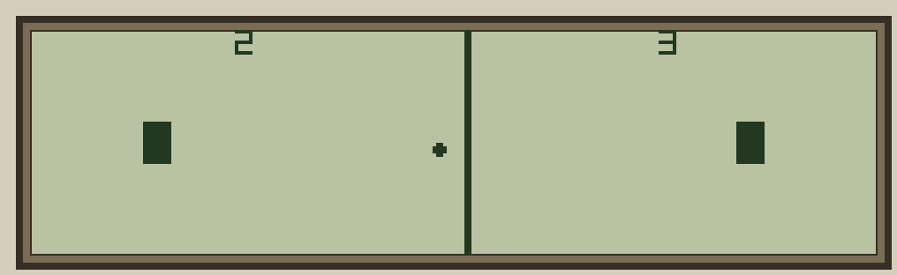

# PONG2P — Two-Player Pong for the Husky Hunter

Human paddle on the left, AI-controlled paddle on the right.
Scores displayed at top of screen; first to 9 wraps back to 0.



Developed from `PONGMP3` (Dev/pongMP/).

**File to transfer:** `PONG2P.HBA` (in `HBA/`)

## Status

**v0.1 — Working.** Human vs AI, delta paddle rendering, conditional score draw.

## Controls

| Key | Action |
| --- | ------ |
| A / a | Left paddle up |
| Z / z | Left paddle down |
| ESC | Exit |

The right paddle tracks the ball automatically.

## Gameplay

* **Ball:** 4×4 pixel sprite, bounces off all four walls
* **Left paddle:** 12px tall, human-controlled (A/Z keys)
* **Right paddle:** 12px tall, AI-controlled
* **Net:** Dashed centre line
* **Scoring:** Goal when ball reaches the opponent's wall — score shown top of screen

## Difficulty

Baked in at generation time via `DIFFICULTY` in `gen_pong2P.py`:

| Level  | Left paddle col | Right paddle col | Wall gap |
| ------ | --------------- | ---------------- | -------- |
| Easy   | 1               | 28               | ~0 cols  |
| Medium | 4               | 25               | ~3 cols  |
| Hard   | 7               | 22               | ~6 cols  |

Current `PONG2P.HBA` is built at **Medium** difficulty. Change `DIFFICULTY` in `gen_pong2P.py` and run Build below to regenerate.

## Technical Details

* **MC size:** 906 bytes (Z80 machine code)
* **Method:** MC stored in DIM array via VARPTR, patched at runtime
* **Parameters:** 18 bytes at fixed address F605H (62981)
* **LCD:** Direct HD61830 I/O with busy-checking
* **LCD optimisations:**
  * *Delta paddle rendering* — only changed rows written each frame (~4 erase + 4 draw per paddle); zero writes when paddle is stationary
  * *Conditional score draw* — scores only redrawn on goal or when ball overlaps score rows (0–6); 14 LCD writes skipped on most frames
* **Input:** BDOS fn 11 (non-blocking status) + fn 6 (read key)

## Files

| File | Description |
| ---- | ----------- |
| `gen_pong2P.py` | Python generator — assembles Z80 MC and outputs `PONG2P.BAS` + `HBA/PONG2P.HBA` |
| `PONG2P.BAS` | BASIC listing — loads MC, draws net, runs game |
| `HBA/PONG2P.HBA` | Tokenised version for transfer via HCOM |

## User Preferences

Edit these constants at the top of `gen_pong2P.py` then regenerate:

| Constant | Default | Description |
| -------- | ------- | ----------- |
| `BALL_DELAY` | 0 | Frame delay counter (0 = max speed; LCD is bottleneck) |
| `PADDLE_SPEED` | 4 | Pixels moved per frame |
| `PADDLE_HEIGHT` | 12 | Paddle height in pixel rows |
| `DIFFICULTY` | 1 | 0=Easy, 1=Medium, 2=Hard (sets paddle column positions) |

## Usage

On the Husky Hunter:

1. Transfer `HBA/PONG2P.HBA` to the Hunter via HCOM over RS-232
2. Enter `BAS`
3. `LOAD "PONG2P"`
4. `RUN`
5. Use A/Z to move your paddle, ESC to exit

## Build

From the repository root:

```
python Progs/pong/2P/gen_pong2P.py
```

This regenerates `Progs/pong/2P/PONG2P.BAS` and `HBA/PONG2P.HBA`.

## Development Notes

Developed through three PONGMP iterations in `Dev/pongMP/` — full history in [Dev/pongMP/README.md](../../Dev/pongMP/README.md).
