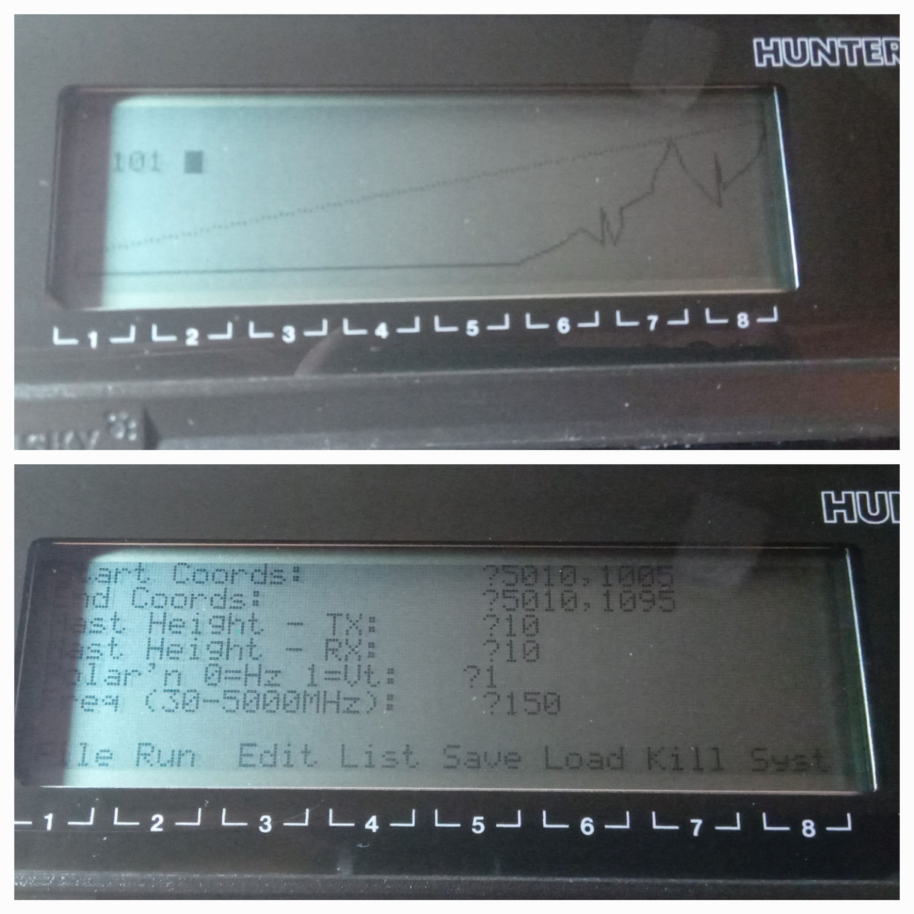
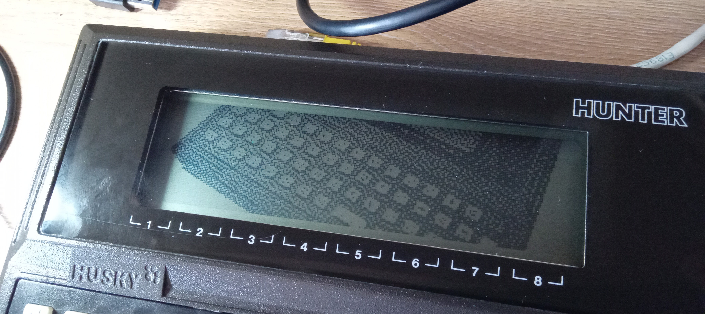
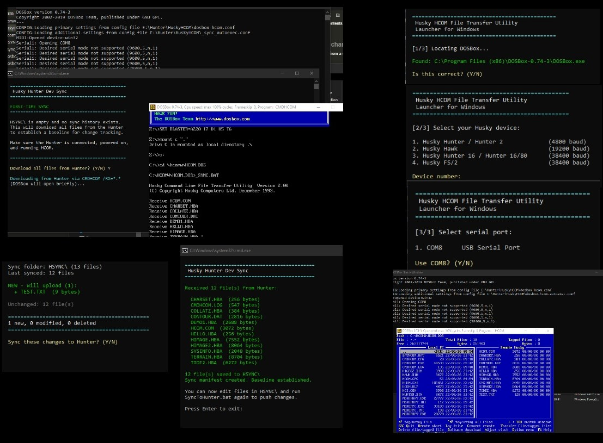

# Husky Hunter — Programs for the 1983 Ruggedised Field Computer

Programs and tools for the **Husky Hunter** portable computer (NSC800-4 @ 4MHz, DEMOS 2.2 / CP/M 2.2, 240×64 LCD).

## Projects

| Project | Description | Status |
| ------- | ----------- | ------ |
| [Terrain](Progs/Terrain/) | Point-to-point radio link profiler — automatic terrain profile extraction from contour data, LOS overlay, dB path loss | Working on hardware |
| [image\_writer](Progs/image_writer/) | PNG/JPEG to Hunter BASIC image converter — Atkinson/Floyd-Steinberg/ordered/threshold dithering for 240×64 LCD | Working on hardware |
| [HuskyHCOM](HuskyHCOM/) | HCOM file transfer launcher for modern 64-bit Windows — DOSBox-based with interactive setup, auto COM port detection, and dev sync workflow | Working |
| [Tide](Progs/Tide/) | Self-contained tidal predictor — computes and plots 24-hour tide curves from 7 harmonic constituents, 6 built-in UK ports | Working on hardware |
| [news\_feed](Progs/news_feed/) | BBC News headline ticker — PC fetches RSS, formats and sends headlines over RS-232 for 40×8 LCD display | Working on hardware |
| [performance\_log](Progs/performance_log/) | Real-time PC performance logger — streams CPU and memory usage over RS-232 to the Hunter's LCD | Working on hardware |

## Reference

* [HUNTER\_BASIC\_GOTCHAS.md](HUNTER_BASIC_GOTCHAS.md) — Hunter BASIC syntax differences, reserved words, and quirks discovered during hardware testing

## The Husky Hunter

Ruggedised portable field computer by DVW Microelectronics / Husky Computers Ltd, Coventry (1983).

| Spec | Detail |
| ---- | ------ |
| CPU | NSC800-4 @ 4 MHz (CMOS Z80-compatible) |
| RAM | 80K / 144K / 208K, battery-backed CMOS |
| ROM | 48K firmware in EPROMs |
| Display | 240 × 64 dot LCD |
| Serial | RS-232 up to 4800 baud |
| OS | DEMOS 2.2 (CP/M 2.2 derivative, RAM-disk) |

Micro Live S02E02: https://www.youtube.com/watch?v=y1ZBr3NInow&t=739s

## License

MIT License. See [Progs/Terrain/LICENSE](Progs/Terrain/LICENSE) for details.